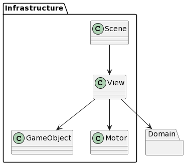

## Common setup

Clone the repo.
```bash
git clone https://github.com/AlbertMontagutCasero/phaser-slot-machine.git
```

Install dependencies
```bash
npm install
```

Run development server
```bash
npm start
```

Build for production
```bash
npm build
```

Parse the linter
```bash
npm lint
```

Run all the tests
```bash
npm test
```

# Architecture
In this project I used TDD as a development approach, so the architecture "emerges". However, we can come up with some statements.

* Domain is completely decoupled from the other layers. It is a sort of use case (BusinessServices) and models that will 
  perform the business related interactions between
  the system and the user.
* Infrastructure is related to how to read the input and present the data that the user can see or interact.
* The infrastructure layer is divided in:
  * Scene: a Phaser scene which will contain all the different GameObjects.
  * View: a pure javascript class that will manage a sort of GameObjects.
  * GameObject: a Phaser GameObject that will manage all the "draw pixels" behaviour into the screen.
  * Motor: (is a HumbleObject,) a solution to make unit test to Views and GameObjects. As Motors are pure javascript classes, they can be very easy to test. Moreover, Motor responsibility is to perform all calculations which views and GameObjects need to present or prepare some data. This way we don't have to instantiate complex framework objects to test.



As a final note, I want to mention that this is just a solution that I came up with while I developed the project. There are a lot of other approaches that can be valid as well. This is just one that allowed me to split the project into small pieces, so it is maintainable, scalable, and reusable.
